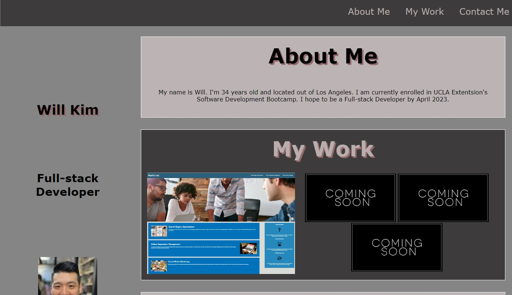

# my-personal-portfolio-wk

## Description

I created this project to display my portfolio in my own unique way. I wanted to use my knowledge of flexbox, media queries and various other CSS variables to showcase my previous projects. I'd like to keep updating this page as I progress through bootcamp.

## Installation

No installation required. Follow link to [https://wiilki.github.io/my-portfolio-page-wk/]

## Usage

Navigate to homepage. Click tabs at top of page to navigate.

## Features

Learn more about me and my projects by navigating with the tabs at the top of the page.